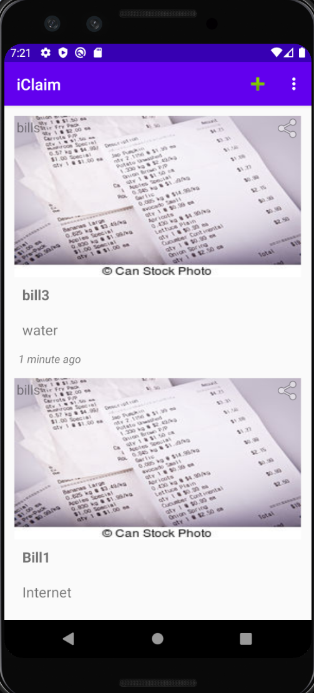

## iClaim
The List of UIs and business logic till March 14:

* Home page
  

* Sign in page

* Registration page

* Add bills page

* Upload a bill

* Recyler view- Giving list of bills.
  

* Authetication in firebase

* Clicking in : gives acces to sign out button
  

* Clicking on the + sign redirects to uplaod an image page

* Storage in firestore

* Storage of bills to maintan polyglot persistance
  

Things to do in the upcomming months:
    * Integrate with Image recogination APS to render in the form of tables
    * Add Chatbot featurs to the application
    * Add polly features to the application 