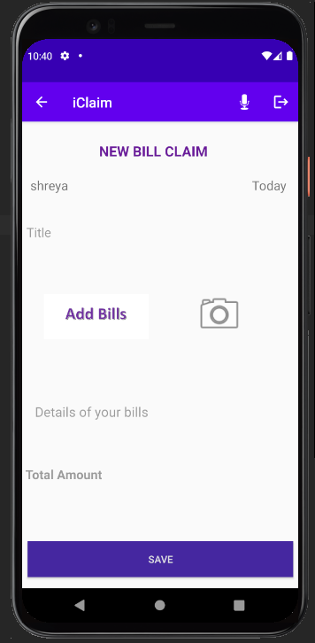
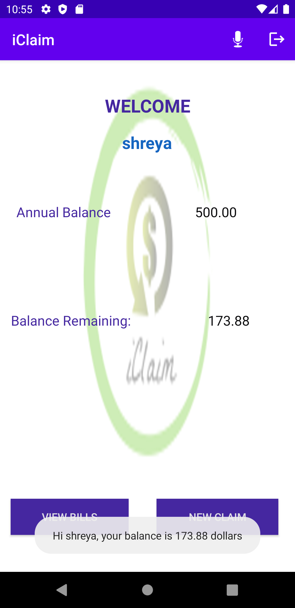

# iClaim - Android App
## University : [San Jose State University](http://www.sjsu.edu/)
## Course: Smartphone App development
## Professor: KaiKai Liu

## Team : 15
Student Name      | 
-------------     |
Parvathi Pai  |
Sania Gonsalves   |
Shreya Ghotankar  |
Krishna Jha  |

### Application Idea
Due to the COVID-19 pandemic most of the companies have adapted work from home and would continue for an unforeseeable future. To help employees create a productive workplace at home and to have a good work-life balance, many companies are providing reimbursement on items like desks, wifi, gym equipment etc., that are purchased by the employees to sustain these unprecedented times.
This android application provides a platform for easy enterprise reimbursements.

### [Project Proposal doc](https://github.com/ParvathiRPai/SmartPhoneApplication/blob/main/Documentation/CMPE277-Project%20Proposal.pdf)

### How to Setup application in your environment
* Clone the repo or download the zip and open in Android Studio IDE
* Firebase
  * Connect to [Firebase Console](https://console.firebase.google.com/)
  * Add project - give the name as "iclaim" and create project
  * In Android Studio open this repo and go to Tools > Firebase. In the Firebase assistance, click on Authentication > Authenticate using custom Authentication System.
  * Click on Connect to Firebase, this will redirect you to your firebase console. Select the iclaim project created in previous step and connect.
  * In your project in Firebase console go to Authentication and make sure that Email/Password is enabled under Sign-in method.
  * Now you can build and run the application. When you create account from the app it will add user to Users in firebase authentication and when you upload a bill it will create collection in firestore and a folder in Storage to save images uploaded by users.

* ChatBot

### Features
* Firebase custom Login
* Upload image to Firebase Storage
* Text Recognition - using Firebase Vision ML kit to identify the total amount from the upload bill's image.
* Firestore - using firestore to keep track of user balance and link user to the images stored in Firebase Storage
* Text to Speech - using android provided test to speech library
* ChatBot - conversational bot using Google DialogFlow

### UI Screenshots
* Home page
  
  

* Sign in page
  
  

* Registration page
  
  

* Dashboard page
  
  

* Upload a bill
  
  
  
* Text Recognition from uploaded bill

  

* Recyler view- Giving list of bills.
  
  
  
* Text to Speech - click microphone icon

  

* Authetication in firebase
  

* Clicking in : gives access to sign out button
  
  

* Storage in firestore
  

* Storage of bills to maintan polyglot persistance
  
  

